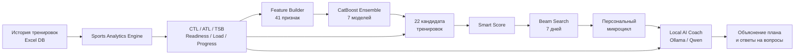
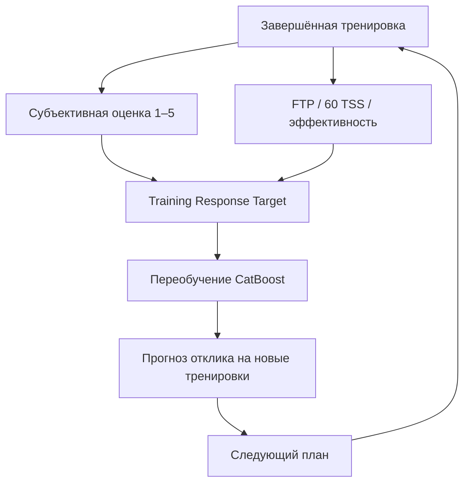

# 🚴 Персональный AI Cycling Coach

**Sports Analytics · Machine Learning · Training Planning · Local AI**

Локальный персональный велотренер, который хранит историю тренировок, оценивает форму и усталость, обучает персональную ML-модель отклика на нагрузку и строит связный план тренировок на 7 дней.

Поверх расчётного контура используется локальный **AI Coach через Ollama/Qwen**: он объясняет, почему алгоритм выбрал конкретную тренировку, сравнивает варианты и отвечает на вопросы по тренировочным данным.

> LLM не управляет нагрузкой напрямую. Она получает уже рассчитанный план и используется как объясняющий слой.

## Что умеет система

- CTL / ATL / TSB на текущую дату;
- Readiness и Coach Score;
- недельная и 28-дневная нагрузка;
- FTP / лучший 60-минутный результат;
- FTP W/кг;
- TSS и TSS/ч;
- тест 60 TSS;
- эффективность Вт/ЧСС;
- динамика веса и спортивных показателей;
- поиск дублей тренировок;
- личные рекорды;
- графики прогресса;
- персональные рекомендации на сегодня;
- связный 7-дневный микроцикл;
- локальный AI-диалог по текущему состоянию и плану.

## AI / ML архитектура

### 1. Sports Engine

Расчётный слой формирует объективное состояние спортсмена: CTL, ATL, TSB, Readiness, нагрузку за разные окна, динамику FTP, W/кг, тест 60 TSS, эффективность и другие признаки.

### 2. Персональная CatBoost-модель

Ансамбль из **7 CatBoostRegressor** обучается на собственной истории спортсмена.

Модель использует **41 признак**, среди которых:

- текущие CTL / ATL / TSB и Readiness;
- дни после последней тренировки;
- TSS за 3 / 7 / 14 дней;
- средняя нагрузка за предыдущие 28 дней;
- коэффициент скачка нагрузки;
- число тренировочных дней;
- последние субъективные оценки;
- плотность TSS/ч;
- FTP, FTP W/кг и их динамика;
- вес и его динамика;
- Вт/ЧСС;
- тест 60 TSS;
- количество тяжёлых дней;
- повторение типов тренировок;
- параметры новой тренировки;
- прогноз недельной нагрузки;
- день недели.

Цель модели — персональный **Training Response Score**: оценка того, насколько конкретная нагрузка подходит спортсмену в текущем состоянии.

## Feedback loop

Последние тренировки имеют больший вес, поэтому модель постепенно адаптируется к спортсмену.

## 22 кандидата тренировок

Планировщик сравнивает варианты от полного отдыха и recovery до Z2, Tempo, Sweet Spot, Threshold, VO₂max, интервалов и контрольного теста.

Каждый кандидат получает **Smart Score**, в котором учитываются:

- прогноз CatBoost;
- соответствие текущей готовности;
- тренировочный стимул;
- соответствие недельной нагрузке;
- разнообразие типов;
- неопределённость прогноза;
- накопленная усталость.

## 7-дневный план

Используется **beam search**.

Для каждого следующего дня алгоритм симулирует новое состояние спортсмена после уже выбранных тренировок.

Ограничения планировщика:

- тяжёлые дни не идут подряд;
- качественные дни не идут подряд;
- есть максимум тяжёлых дней в неделю;
- после тяжёлой тренировки длинная/качественная работа получает штраф;
- алгоритм всегда сохраняет вариант отдыха;
- итоговая недельная нагрузка должна быть близка к целевой.

Таким образом план — это не семь независимых советов, а **единый микроцикл**.

## Local AI Coach

После расчёта плана структурированные метрики передаются локальной LLM через Ollama.

AI Coach может отвечать на вопросы:

- «Почему завтра Sweet Spot?»
- «Почему сегодня не VO₂max?»
- «Что именно говорит об усталости?»
- «Насколько эта неделя тяжелее предыдущей?»
- «Что изменилось в форме за последнее время?»

LLM не может обойти ограничения планировщика и не придумывает значения, которых нет в данных.

Если Ollama недоступна, интерфейс показывает детерминированное объяснение расчётного плана.

## Приватность

Тренировочная история остаётся локальной.

Реальная `Cycling_Coach_DB.xlsx` в публичный GitHub не публикуется. В публичной версии приложение создаёт пустую Excel-базу автоматически при первом запуске.

## Стек

`Python` · `Flask` · `CatBoost` · `openpyxl` · `JavaScript` · `HTML/CSS` · `Beam Search` · `Ollama` · `Qwen / Local LLM`

## Моя роль

Архитектура продукта, расчёт спортивных метрик, feature engineering, персональная ML-модель, алгоритм оптимизации недельного плана, backend/web-интерфейс, локальный AI-слой и логика обратной связи.

> Проект является инструментом спортивной аналитики и планирования, а не медицинским сервисом.
