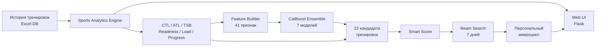
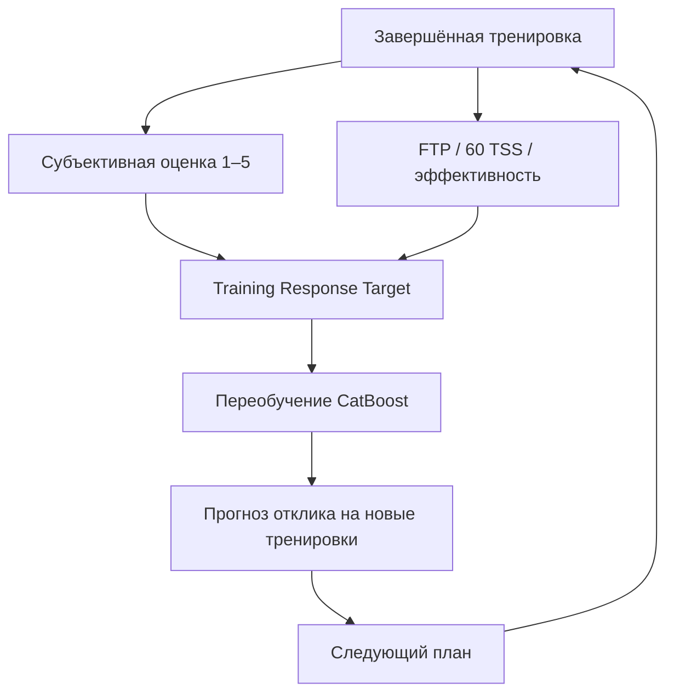

# 🚴 Персональный Cycling Coach

**Sports Analytics · Machine Learning · Training Planning · Web Application**

Отдельный проект персонального велотренера: локальное веб-приложение для хранения истории тренировок, оценки текущей формы и усталости, анализа спортивного прогресса и построения индивидуального плана тренировок.

Этот проект **не связан с проектом AI Agent**. Здесь нет Qwen, Ollama, Jira и агентной архитектуры.

## Что умеет система

- CTL / ATL / TSB на текущую дату;
- Readiness и Coach Score;
- недельная и 28-дневная нагрузка;
- FTP / лучший 60-минутный результат;
- FTP W/кг;
- TSS и TSS/ч;
- тест 60 TSS;
- эффективность Вт/ЧСС;
- динамика веса и спортивных показателей;
- поиск дублей тренировок;
- личные рекорды;
- графики прогресса;
- персональные рекомендации на сегодня;
- связный 7-дневный микроцикл.

## Архитектура

## Sports Analytics Engine

Расчётный слой формирует текущее состояние спортсмена: CTL, ATL, TSB, Readiness, нагрузку за разные временные окна, динамику FTP, W/кг, тест 60 TSS, эффективность и другие показатели.

## Персональная CatBoost-модель

Ансамбль из **7 CatBoostRegressor** обучается на собственной истории спортсмена.

Используется **41 признак**, среди которых:

- текущие CTL / ATL / TSB и Readiness;
- дни после последней тренировки;
- TSS за 3 / 7 / 14 дней;
- средняя нагрузка за предыдущие 28 дней;
- коэффициент скачка нагрузки;
- количество тренировочных дней;
- последние субъективные оценки;
- плотность TSS/ч;
- FTP, FTP W/кг и их динамика;
- вес и его динамика;
- Вт/ЧСС;
- тест 60 TSS;
- количество тяжёлых дней;
- повторение типов тренировок;
- параметры новой тренировки;
- прогноз недельной нагрузки;
- день недели.

Цель модели — персональный **Training Response Score**: оценка того, насколько конкретная нагрузка подходит спортсмену в текущем состоянии.

## Feedback loop

Последние тренировки имеют больший вес, поэтому модель постепенно адаптируется к спортсмену.

## 22 кандидата тренировок

Планировщик сравнивает варианты от полного отдыха и recovery до Z2, Tempo, Sweet Spot, Threshold, VO₂max, интервалов и контрольного теста.

Каждый кандидат получает **Smart Score**, в котором учитываются:

- прогноз CatBoost;
- соответствие текущей готовности;
- тренировочный стимул;
- соответствие недельной нагрузке;
- разнообразие типов;
- неопределённость прогноза;
- накопленная усталость.

## 7-дневный план

Для построения связного микроцикла используется **beam search**.

Для каждого следующего дня алгоритм симулирует новое состояние спортсмена после уже выбранных тренировок.

Ограничения планировщика:

- тяжёлые дни не идут подряд;
- качественные дни не идут подряд;
- ограничивается количество тяжёлых дней в неделю;
- после тяжёлой тренировки длинная или качественная работа получает штраф;
- алгоритм всегда сохраняет вариант отдыха;
- итоговая недельная нагрузка должна быть близка к целевой.

Таким образом план — это не семь независимых советов, а единый недельный микроцикл.

## Данные и приватность

Тренировочная история хранится локально.

Реальная `Cycling_Coach_DB.xlsx` в публичный GitHub не публикуется. В публичной версии должна использоваться пустая или демонстрационная база.

## Стек

`Python` · `Flask` · `CatBoost` · `openpyxl` · `JavaScript` · `HTML/CSS` · `Beam Search` · `Sports Analytics`

## Моя роль

Архитектура продукта, расчёт спортивных метрик, feature engineering, персональная ML-модель, алгоритм оптимизации недельного плана, backend и web-интерфейс.

> Проект является инструментом спортивной аналитики и планирования, а не медицинским сервисом.
